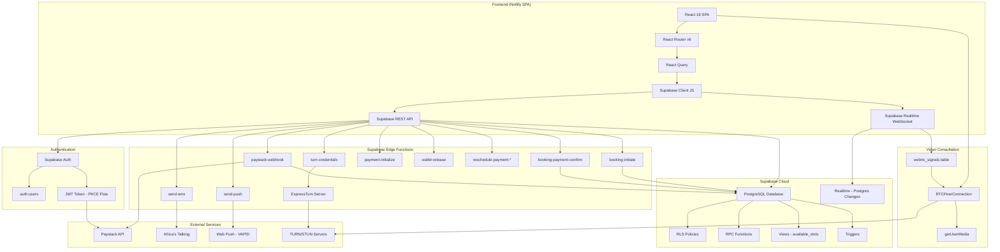
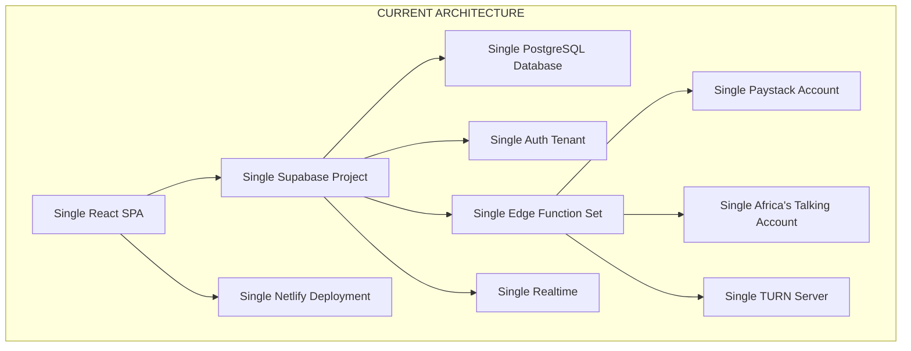
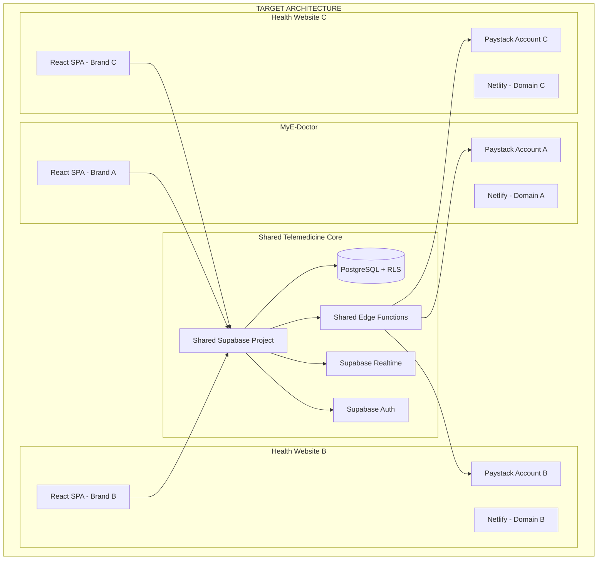

# MyE-Doctor Technical Architecture Audit

**Audit Date:** 27 August 2026  
**Auditor:** opencode (automated technical audit)  
**Repository:** your-health-hub  
**Version:** 1.2.0

---

## Table of Contents

1. [Executive Summary](#1-executive-summary)
2. [Technology Stack](#2-technology-stack)
3. [Repository Structure](#3-repository-structure)
4. [Application Architecture](#4-application-architecture)
5. [Frontend Architecture](#5-frontend-architecture)
6. [Backend and Database Architecture](#6-backend-and-database-architecture)
7. [Authentication and Authorization](#7-authentication-and-authorization)
8. [Telemedicine Consultation Architecture](#8-telemedicine-consultation-architecture)
9. [Video and Real-Time Architecture](#9-video-and-real-time-architecture)
10. [Payment Architecture](#10-payment-architecture)
11. [Notification Architecture](#11-notification-architecture)
12. [Multi-Tenancy Assessment](#12-multi-tenancy-assessment)
13. [Reuse Potential](#13-reuse-potential)
14. [Recommended Target Architecture](#14-recommended-target-architecture)
15. [Database Migration Strategy](#15-database-migration-strategy)
16. [Recommended Migration Phases](#16-recommended-migration-phases)
17. [Technical Risks](#17-technical-risks)
18. [Final Recommendation](#18-final-recommendation)

---

## 1. Executive Summary

MyE-Doctor is a **full-stack telemedicine application** built as a React SPA frontend backed by **Supabase** (BaaS) with serverless **Edge Functions** handling business logic. It is NOT a traditional full-stack app with a custom backend server.

**What it is from a technical perspective:**
- A production telemedicine platform enabling doctor discovery, appointment booking, video/audio/chat consultations, clinical documentation, e-prescriptions, patient wallets, doctor wallets, and admin management
- Deployed on **Netlify** (frontend) + **Supabase Cloud** (database, auth, realtime, edge functions, storage)
- Written in TypeScript across the entire stack
- Currently a **single-tenant application** with no multi-tenancy support

**Major architectural components:**
- React 18 SPA with React Router v6, React Query, Tailwind CSS + shadcn/ui
- Supabase PostgreSQL database with 20+ tables, RLS policies, RPC functions, triggers, and views
- 14 Deno-based Supabase Edge Functions handling booking, payment, TURN credentials, SMS, push notifications, wallet operations
- Custom WebRTC implementation using Supabase Realtime for signaling via the `webrtc_signals` table
- Paystack payment gateway with webhook verification
- PWA support with service workers

**Main constraints affecting multi-tenant evolution:**
1. No organisation/tenant concept exists in the database schema
2. Authentication is user-level only (Supabase Auth) with no organisation membership
3. Branding, pricing rules, and doctor pools are globally shared
4. Frontend is a monolithic SPA with hardcoded MyE-Doctor branding throughout
5. Edge functions use a single Supabase project with shared service role key
6. Payment is tightly coupled to a single Paystack account
7. Database tables lack any tenant_id foreign key
8. RLS policies are user-level, not tenant-aware

---

## 2. Technology Stack

| Category | Technology | Version | Source File |
|----------|-----------|---------|-------------|
| **Frontend Framework** | React | ^18.3.1 | `package.json:62` |
| **Programming Language** | TypeScript | ^5.8.3 | `package.json:93` |
| **Build Tool** | Vite | ^5.4.19 | `package.json:95` |
| **Vite Plugin** | @vitejs/plugin-react-swc | ^3.11.0 | `package.json:83` |
| **UI Component Library** | shadcn/ui (Radix primitives) | Various | `components.json`, `package.json:23-48` |
| **Styling Framework** | Tailwind CSS | ^3.4.17 | `package.json:92` |
| **Styling Utilities** | tailwindcss-animate, tailwind-merge, class-variance-authority | Various | `package.json:51-70` |
| **State Management** | React Context + @tanstack/react-query | ^5.83.0 | `package.json:50` |
| **Routing** | react-router-dom | ^6.30.1 | `package.json:67` |
| **Backend/Database** | Supabase (PostgreSQL + Auth + Realtime + Edge Functions) | ^2.90.0 | `package.json:49` |
| **Database** | PostgreSQL (via Supabase Cloud) | - | `supabase/migrations/20260220163547_remote_schema.sql.replicaonly.txt` |
| **Authentication** | Supabase Auth (PKCE flow) | - | `src/integrations/supabase/client.ts` |
| **File Storage** | Supabase Storage (patient files, doctor licenses) | - | Referenced in RLS policies (`db/45_fix_doctor_files_storage_rls.sql`) |
| **Real-time Technology** | Supabase Realtime (Postgres Changes) | - | `src/hooks/useRealtimeNotifications.ts`, `src/services/consultationService.ts` |
| **Video/Audio** | WebRTC (browser-native, no SDK) | - | `src/services/webrtcService.ts` |
| **TURN/STUN** | ExpressTurn (HMAC-SHA1 ephemeral credentials) | - | `supabase/functions/turn-credentials/index.ts` |
| **Payment Provider** | Paystack (inline checkout + webhooks) | - | `src/hooks/usePaystackPayment.ts`, `supabase/functions/paystack-webhook/index.ts` |
| **SMS Provider** | Africa's Talking API | - | `src/services/smsService.ts`, `supabase/functions/send-sms/index.ts` |
| **Push Notifications** | Web Push API (VAPID) | - | `src/hooks/usePushSubscription.ts`, `supabase/functions/send-push/index.ts` |
| **Email** | Supabase Edge Functions (custom implementation) | - | `src/services/emailService.ts` |
| **PWA** | vite-plugin-pwa (Workbox) | ^1.2.0 | `package.json:73`, `vite.config.ts:16` |
| **Calendar** | FullCalendar | ^6.1.20 | `package.json:16-20` |
| **Charts** | Recharts | ^2.15.4 | `package.json:68` |
| **PDF Generation** | jsPDF | ^2.5.2 | `package.json:58` |
| **QR Codes** | qrcode | ^1.5.4 | `package.json:61` |
| **Deployment (Frontend)** | Netlify | - | `netlify.toml` |
| **Deployment (Backend)** | Supabase Cloud (Deno Edge Functions) | - | `package.json:12-13` (deploy scripts) |
| **Dev Server Port** | 8080 | - | `vite.config.ts:11` |
| **Fonts** | Plus Jakarta Sans | - | `tailwind.config.ts:18` |

---

## 3. Repository Structure

```
your-health-hub/
├── src/
│   ├── main.tsx                    # App entry point, PWA registration
│   ├── App.tsx                     # Router, providers, global handlers
│   ├── index.css                   # Global styles, CSS variables
│   ├── components/
│   │   ├── admin/                  # Admin panels (5 files)
│   │   ├── consultation/           # Consultation room, chat, clerking (10 files)
│   │   ├── coo/                    # COO messaging (2 files)
│   │   ├── doctor-portal/          # Doctor portal components (1 file)
│   │   ├── patient-portal/         # Patient portal components (1 file)
│   │   ├── layout/                 # Header, Footer, Layout wrapper (4 files)
│   │   ├── ui/                     # shadcn/ui components
│   │   ├── ProtectedRoute.tsx      # Role-based route guard
│   │   └── ...
│   ├── pages/                      # 32 page components
│   │   ├── Auth.tsx                # Login/register (1,382 lines)
│   │   ├── PatientPortal.tsx       # Patient dashboard (5,698 lines)
│   │   ├── DoctorPortal.tsx        # Doctor dashboard (5,937 lines)
│   │   ├── CentralAdmin.tsx        # Admin dashboard (4,747 lines)
│   │   ├── Consultation.tsx        # Consultation session (265 lines)
│   │   ├── DoctorDiscovery.tsx     # Doctor search/browse
│   │   ├── Booking.tsx             # Appointment booking
│   │   └── ...
│   ├── hooks/                      # 29 custom React hooks
│   ├── services/                   # 14 service modules
│   ├── contexts/                   # AuthContext, LanguageContext
│   ├── lib/                        # 10 utility modules
│   ├── config/                     # marketplaceDefaults.ts
│   └── integrations/supabase/      # Supabase client singleton
├── supabase/
│   ├── functions/                  # 14 Edge Functions
│   │   ├── _shared/                # Shared types + 6 service classes
│   │   ├── booking-initiate/
│   │   ├── booking-payment-confirm/
│   │   ├── paystack-webhook/
│   │   ├── turn-credentials/
│   │   ├── send-sms/
│   │   ├── send-push/
│   │   ├── payment-initialize/
│   │   ├── wallet-release/
│   │   ├── reschedule-payment-confirm/
│   │   ├── reschedule-payment-initiate/
│   │   ├── discovery-starting-prices/
│   │   ├── pricing-preview/
│   │   └── create-test-patient/
│   └── migrations/                 # 57 migration files
├── db/                             # 101 SQL files (schema, RPC, RLS)
│   └── rpc/                        # 1 RPC function
├── public/                         # Static assets, PWA manifests
├── vite.config.ts                  # Build config with PWA
├── tailwind.config.ts              # Theme + design tokens
├── netlify.toml                    # SPA redirect rules
└── package.json                    # Dependencies, deploy scripts
```

**Key Architectural Observations:**
- **Monolithic pages**: `PatientPortal.tsx` (5,698 lines), `DoctorPortal.tsx` (5,937 lines), `CentralAdmin.tsx` (4,747 lines) are extremely large single-file components containing all dashboard logic
- **Dual schema management**: Database schema exists in both `db/` folder (101 SQL files) and `supabase/migrations/` (57 files), with unclear synchronization
- **Minimal component decomposition**: Only 1 file in `doctor-portal/` and 1 in `patient-portal/` despite massive portal pages

---

## 4. Application Architecture

### Current Request and Data Flow



### Communication Patterns

| Path | Protocol | Mechanism |
|------|----------|-----------|
| Frontend → Supabase DB | HTTPS | Supabase JS SDK (REST/PostgREST) |
| Frontend → Supabase Auth | HTTPS | Supabase JS SDK (PKCE flow) |
| Frontend → Edge Functions | HTTPS | `supabase.functions.invoke()` |
| Frontend → Realtime | WSS | Supabase Realtime (WebSocket) |
| Edge Functions → DB | HTTPS | Supabase service role client |
| Edge Functions → Paystack | HTTPS | REST API |
| Edge Functions → Africa's Talking | HTTPS | REST API |
| Paystack → Edge Functions | HTTPS | Webhook (charge.success/failed) |
| Doctor ↔ Patient (WebRTC) | P2P/SRTP | RTCPeerConnection via webrtc_signals |

---

## 5. Frontend Architecture

### Entry Point
- `src/main.tsx:1` — Creates React root, registers PWA service worker
- `src/App.tsx:213` — Application shell with providers and routes

### Routing Structure

**Public Routes:**
| Path | Component | Purpose |
|------|-----------|---------|
| `/` | `Index` | Landing page |
| `/auth` | `Auth` | Login/register |
| `/forgot-password` | `ForgotPassword` | Password reset |
| `/services` | `Services` | Service listing |
| `/specialists` | `Specialists` | Specialist directory |
| `/doctor-discovery` | `DoctorDiscovery` | Browse doctors |
| `/slot-selection` | `SlotSelection` | Time slot picker |
| `/booking/:doctorId?` | `Booking` | Appointment booking |
| `/contact` | `Contact` | Contact form |
| `/blog` | `Blog` | Blog posts |
| `/privacy` | `PrivacyPolicy` | Privacy policy |
| `/about` | `AboutUs` | About page |
| `/careers` | `Careers` | Careers page |
| `/for-doctors` | `ForDoctors` | Doctor recruitment |
| `/help` | `HelpCenter` | Help center |
| `/faq` | `FAQ` | FAQ page |
| `/install` | `Install` | PWA install prompt |
| `/verify/:code` | `VerifyPrescription` | Prescription verification |

**Authenticated Patient Routes:**
| Path | Component | Guard |
|------|-----------|-------|
| `/patient-portal` | `PatientPortal` | `ProtectedRoute` (role=patient, requireCompletedRegistration) |
| `/consultation/:appointmentId` | `Consultation` | None (relies on session validation) |
| `/complete-registration` | `CompleteRegistration` | `ProtectedRoute` |

**Authenticated Doctor Routes:**
| Path | Component | Guard |
|------|-----------|-------|
| `/doctor-portal` | `DoctorPortal` | `ProtectedRoute` (role=doctor, requireCompletedRegistration) |

**Admin Routes:**
| Path | Component | Guard |
|------|-----------|-------|
| `/admin/login` | `AdminLogin` | None |
| `/admin` | `CentralAdmin` | None (manual role check inside component) |

**COO Routes:**
| Path | Component | Guard |
|------|-----------|-------|
| `/coo/login` | `CooLogin` | None |
| `/coo` | `COOPortal` | None (manual role check inside component) |

**HealthLink Routes:**
| Path | Component | Guard |
|------|-----------|-------|
| `/healthlink/login` | `HealthLinkLogin` | None |
| `/healthlink` | `HealthLinkPortal` | `ProtectedRoute` (role=healthlink) |

### Shared Components
- `src/components/ui/` — shadcn/ui primitives (button, card, dialog, toast, etc.)
- `src/components/layout/` — Header, Footer, Layout wrapper
- `src/components/consultation/` — ConsultationRoom, ChatSidebar, ClerkingPanel, ControlBar, DoctorNotesPanel, PatientLobby, PreConsultationCheck, ConsultationHistory, JoinConsultationButton
- `src/components/ProtectedRoute.tsx` — Role-based route guard with registration completion check
- `src/components/ScheduleEditor.tsx` — Doctor schedule management
- `src/components/SlotSelectionModal.tsx` — Time slot selection

### Custom Hooks (29 hooks)
Key hooks by domain:
- **Auth**: `useAuth`
- **Appointments**: `useAppointments`, `useAvailableSlots`, `useAppointmentReminders`, `useAppointmentSMS`
- **Consultation**: `useConsultation`
- **Payments**: `usePaystackPayment`, `usePlatformFeeRules`, `useDoctorEarnings`
- **Wallet**: `usePatientWallet` (via PatientWalletService)
- **Doctor**: `useDoctorRegistration`, `useDoctorStats`, `useRecentReviews`, `useDoctorPresence`
- **Patient**: `usePatientRegistration`, `usePatientPresence`
- **Notifications**: `useNotifications`, `useRealtimeNotifications`, `useNotificationSound`, `usePushSubscription`, `useRequestNotificationPermission`
- **Presence**: `useTrackPresence`, `useTrackUserPresence`
- **Health Records**: `useHealthRecords`
- **Promotions**: `useActivePatientPromotion`
- **UI**: `use-mobile`, `use-toast`, `usePwaInstall`

### Context Providers
1. **AuthProvider** (`src/contexts/AuthContext.tsx`) — Supabase auth state, user role, sign out
2. **LanguageProvider** (`src/contexts/LanguageContext.tsx`) — i18n for multi-language support
3. **QueryClientProvider** — React Query for server state
4. **TooltipProvider** — Radix tooltip context

### API/Data-Access Layer
- `src/integrations/supabase/client.ts` — Supabase client singleton (PKCE flow, session persistence)
- `src/services/` — 14 service modules wrapping Supabase queries and edge function calls
- React Query hooks in `src/hooks/` — Cache management and data fetching patterns

### Type Definitions
- `src/services/marketplaceTypes.ts` — Core business types (PricingProfile, PricingRule, DoctorTier, AppointmentStatus, etc.)
- `src/contexts/authContextValue.tsx` — AuthRole, AuthContextType
- `src/services/consultationService.ts` — ConsultationSession, ConsultationMessage interfaces

### Frontend Modularity Assessment
The frontend is **NOT sufficiently modular** for a shared telemedicine SDK or reusable component library:
- Pages are monolithic (5,000+ line files with all logic inline)
- Business logic is embedded in page components, not extracted into services/hooks
- No component library package structure
- No separate domain models or DTOs
- Hardcoded MyE-Doctor branding, text, and URLs throughout

---

## 6. Backend and Database Architecture

### Database Tables Identified in Codebase

#### Core Tables

| Table | Purpose | Primary Identifier | Key Relationships | Access Roles |
|-------|---------|-------------------|-------------------|-------------|
| `appointments` | Appointment bookings | `id` (UUID) | FK→auth.users (patient_id, doctor_id) | patient, doctor, admin, coo |
| `consultation_sessions` | Active consultation sessions | `id` (UUID) | FK→appointments (appointment_id) | patient, doctor, admin |
| `consultation_messages` | In-consultation chat messages | `id` (UUID) | FK→consultation_sessions (session_id) | patient, doctor |
| `consultation_recordings` | Consultation recording metadata | `id` (UUID) | FK→consultation_sessions (session_id) | admin |
| `webrtc_signals` | WebRTC signaling data | `id` (UUID) | FK→consultation_sessions (session_id) | patient, doctor |
| `doctor_registrations` | Doctor registration/application | `id` (UUID), unique `user_id` | FK→auth.users (user_id) | doctor (own), admin |
| `patient_registrations` | Patient registration/profile | `id` (UUID), unique `user_id` | FK→auth.users (user_id) | patient (own), admin |
| `doctors` | Doctor public profile | `id` (UUID = auth.users.id) | FK→auth.users (id) | doctor (own), public discovery |
| `profiles` | Minimal user profile | `id` (UUID = auth.users.id) | FK→auth.users (id) | owner |
| `doctor_schedules` | Doctor availability slots | `id` (UUID) | FK→doctors (doctor_id) | doctor (own) |
| `payments` | Payment records | `id` (UUID), unique `payment_reference` | FK→appointments, auth.users (patient_id) | patient (own), admin |
| `doctor_consultation_notes` | Clinical notes per session | `id` (UUID) | FK→consultation_sessions, auth.users | doctor (own) |
| `patient_folders` | Patient clinical records (SOAP) | `id` (UUID), unique `patient_id` | FK→auth.users (patient_id) | doctor (if related), patient (own) |
| `health_records` | Patient health file uploads | `id` (UUID) | FK→auth.users (patient_id) | patient (own) |
| `prescription_verifications` | E-prescription verification codes | `id` (UUID), unique `code` | FK→doctor_consultation_notes, auth.users | patient (own), doctor (own), public (verify) |
| `contact_messages` | Support/contact form submissions | `id` (UUID) | None | admin |
| `sms_logs` | SMS sending audit trail | `id` (UUID) | None | admin |

#### Tables Added by Later Migrations

| Table | Migration | Purpose |
|-------|-----------|---------|
| `coo_messages` | `20260303100000` | COO-to-user messaging |
| `platform_settings` | `20260418010000` | Platform-wide configuration |
| `pricing_profiles` | `db/35_marketplace_pricing_wallet_refactor.sql` | Pricing configurations |
| `pricing_rules` | `db/35_marketplace_pricing_wallet_refactor.sql` | Price calculation rules |
| `pricing_feature_flags` | `db/35_marketplace_pricing_wallet_refactor.sql` | Feature flags |
| `consultation_types` | `db/35_marketplace_pricing_wallet_refactor.sql` | Consultation type definitions |
| `doctor_tiers` | `db/35_marketplace_pricing_wallet_refactor.sql` | Doctor experience tiers |
| `appointment_duration_options` | `20260302100000` | Duration options |
| `platform_fee_rules` | `db/35_marketplace_pricing_wallet_refactor.sql` | Platform fee configuration |
| `doctor_wallet` | `db/35_marketplace_pricing_wallet_refactor.sql` | Doctor wallet balances |
| `doctor_wallet_transactions` | `db/35_marketplace_pricing_wallet_refactor.sql` | Doctor wallet transactions |
| `patient_wallet` | `20260228110000` | Patient wallet balances |
| `patient_wallet_transactions` | `20260228110000` | Patient wallet transactions |
| `patient_wallet_withdrawal_requests` | `20260228110000` | Withdrawal request queue |
| `push_subscriptions` | `20260408110000` | Web push subscription endpoints |
| `active_promotions` | `20260418000000` | Promotional discounts |
| `admin_notifications` | Various | Admin alert queue |

### Views

| View | Purpose | Defined In |
|------|---------|-----------|
| `available_slots` | Computed available appointment slots | Initial migration |
| `list_public_doctors` | Public doctor discovery | `db/67_add_currency_to_list_public_doctors.sql` |

### Key RPC Functions (Stored Procedures)

| Function | Purpose | File Reference |
|----------|---------|---------------|
| `doctor_append_to_patient_folder` | Add/update clinical notes to patient folder | `db/rpc/doctor_append_to_patient_folder.sql` |
| `ensure_patient_registration` | Upsert patient profile on signup | Initial migration |
| `admin_delete_user` | Cascade delete user and all related data | Initial migration |
| `admin_update_doctor_registration` | Admin doctor approval workflow | Initial migration |
| `ensure_prescription_verification` | Create prescription verification codes | Initial migration |
| `verify_prescription_public` | Public prescription lookup by code | Initial migration |
| `mark_prescription_downloaded` | Track prescription download | Initial migration |
| `upsert_doctor_profile` | Upsert doctor public profile | Initial migration |
| `request_appointment_reschedule` | Patient-initiated reschedule | `src/services/AppointmentRescheduleService.ts` |
| `respond_appointment_reschedule` | Doctor approve/decline reschedule | `src/services/AppointmentRescheduleService.ts` |
| `mark_appointment_needs_follow_up` | Start 3-day follow-up window | `src/services/consultationService.ts` |
| `complete_overdue_follow_up_appointments` | Auto-complete expired follow-ups | `src/services/consultationService.ts` |
| `debit_patient_wallet_for_booking` | Wallet debit with validation | Edge function: `booking-initiate` |
| `credit_patient_wallet_adjustment` | Wallet credit/refund | Edge functions: `paystack-webhook`, `wallet-release` |
| `mark_appointment_auto_promoted` | Auto-promote paid appointments | Various migrations |
| `check_email_exists` | Email availability check | `db/48_add_email_exists_rpc.sql` |
| `admin_search_platform_users` | Admin user search | `db/49_admin_search_platform_users.sql` |

### Row Level Security (RLS) Assumptions

From the initial migration and subsequent fixes:
- RLS is **enabled** on all core tables
- Admin/COO access uses `is_admin_or_coo()` function (email-based allowlist fallback)
- Doctor access: own data via `auth.uid()` = `doctor_id` or `user_id`
- Patient access: own data via `auth.uid()` = `patient_id` or `user_id`
- Service role bypass: `auth.jwt()->>'role' = 'service_role'`
- Public read access: `doctors` table for doctor discovery, `available_slots` view
- Consultation access: restricted to participants of the specific session/appointment
- `appointments` has permissive SELECT policy allowing `true` (all authenticated users can read — security concern)

---

## 7. Authentication and Authorization

### Sign Up Flow
1. **Patient**: `Auth.tsx` → `supabase.auth.signUp()` with `user_metadata: { role: 'patient', full_name, phone }` → trigger `create_patient_registration_from_user()` creates `patient_registrations` row → `ProtectedRoute` checks `post_auth_prompt_completed` flag → redirects to `/complete-registration` if incomplete
2. **Doctor**: `Auth.tsx` → `supabase.auth.signUp()` with `user_metadata: { role: 'doctor' }` → trigger `handle_new_user()` creates `profiles` row + `doctors` row → user completes `doctor_registrations` form → admin approves → trigger `handle_doctor_registration_approved()` syncs to `doctors` table and updates `auth.users.raw_user_meta_data.role = 'doctor'`
3. **Admin/COO**: Seeded via database migration (`20260325110000`), not through self-registration
4. **HealthLink**: Role assigned via `auth.users` metadata, login at `/healthlink/login`

### Sign In Flow
- `Auth.tsx` → `supabase.auth.signInWithPassword()` → `onAuthStateChange` → `AuthProvider` extracts role from `user_metadata.role` → stored in state + `localStorage` → `ProtectedRoute` checks role against route requirements

### Role System
- **5 roles**: `patient`, `doctor`, `admin`, `coo`, `healthlink`
- Role stored in: `auth.users.raw_user_meta_data.role`
- Parsed by: `parseAppRole()` in `AuthContext.tsx:8` and `ProtectedRoute.tsx:14`
- **No role table** — roles are embedded in JWT metadata only

### Authorization Enforcement
- **Frontend**: `ProtectedRoute` component checks `requiredRole` prop against user role
- **Backend (RLS)**: Policies check `auth.uid()` ownership and `auth.jwt()->>'role'` for admin
- **Backend (Edge Functions)**: Service role client + `getUser(token)` verification
- **Weakness**: Admin/COO portal pages (`CentralAdmin.tsx`, `COOPortal.tsx`) do NOT use `ProtectedRoute` with role checks — they perform manual role checks inside the component, which is less secure

### Organisation/Multi-Tenancy
- **NOT supported**: No `organisation_id` or `tenant_id` on any table
- Users are not associated with any organisation entity
- All doctors belong to a single global pool
- All patients belong to a single global pool
- No tenant-aware RLS policies

---

## 8. Telemedicine Consultation Architecture

### Complete Consultation Flow

#### 1. Doctor Creates/Manages Availability
- **File**: `src/hooks/useSchedules.ts`
- **Component**: `src/components/ScheduleEditor.tsx`
- **Table**: `doctor_schedules`
- **Process**: Doctor sets day_of_week, start_time, end_time, slot_duration_minutes, max_patients_per_slot via CRUD on `doctor_schedules` table
- **Edge function**: None — direct Supabase client operations

#### 2. Patient Finds/Selects a Doctor
- **Page**: `src/pages/DoctorDiscovery.tsx`
- **View**: `available_slots` (computed view joining doctors, doctor_schedules, doctor_registrations, appointments)
- **Table**: `doctors` (public profile), `doctor_registrations` (verification status)
- **Edge function**: `discovery-starting-prices` — returns starting prices for doctor cards

#### 3. Patient Books a Consultation
- **Page**: `src/pages/Booking.tsx`
- **Hook**: `usePaystackPayment.ts`
- **Service**: `src/services/BookingService.ts` (frontend wrapper)
- **Edge Function**: `booking-initiate/index.ts` → `BookingService` (server-side, 1114 lines)
- **Process**:
  1. Frontend calls `supabase.functions.invoke('booking-initiate', { body: bookingInput })`
  2. Edge function validates slot availability via `AvailabilityService`
  3. Calculates price via `PricingService` (doctor rate or rule-based pricing)
  4. Checks promotion eligibility via `PromotionService`
  5. Creates `appointments` row with status `pending_payment`
  6. For Paystack: creates `payments` record + initializes Paystack transaction via `PaymentService`
  7. For wallet: debits `patient_wallet` via RPC `debit_patient_wallet_for_booking`
  8. For hybrid: splits payment between wallet and Paystack
  9. Returns `BookingInitiateResponse` with payment initialization data

#### 4. Payment Initiated and Confirmed
- **Frontend**: `usePaystackPayment.ts` opens Paystack inline checkout popup
- **Paystack callback**: Patient completes payment → `onSuccess` callback fires
- **Confirmation path 1** (frontend): `src/services/BookingService.ts` → `supabase.functions.invoke('booking-payment-confirm', { reference })` → `BookingService.finalizeSuccessfulPayment()`
- **Confirmation path 2** (webhook): Paystack sends webhook → `paystack-webhook/index.ts` → signature verification → `BookingService.finalizeSuccessfulPayment()`
- **Process**:
  1. Verify payment with Paystack API
  2. Mark `payments.status = 'completed'`
  3. Update `appointments.status = 'pending_approval'`
  4. Add doctor pending earning via `WalletService.addPendingEarning()`

#### 5. Appointment Created
- **Table**: `appointments` — status transitions: `pending_payment` → `pending_approval` → `confirmed` → `in_progress` → `completed`
- **Appointment columns**: patient_id, doctor_id, date, time, duration_minutes, consultation_type, final_price, currency, price_breakdown, status

#### 6. Doctor and Patient Notified
- **Real-time notifications**: `src/hooks/useRealtimeNotifications.ts` subscribes to `appointments` table changes via Supabase Realtime
- **In-app toast**: `toast()` from sonner/toast
- **Push notification**: `triggerNotificationAlert()` from `src/lib/notificationAlert.ts`
- **SMS**: `src/hooks/useAppointmentSMS.ts` → `smsService` → `supabase.functions.invoke('send-sms')`
- **Email**: `src/services/emailService.ts` → `supabase.functions.invoke('send-email')`

#### 7. Consultation Session Begins
- **Page**: `src/pages/Consultation.tsx`
- **Phase flow**: `loading` → `pre-check` → `waiting` → `in-call` → `ended`
- **Service**: `src/services/consultationService.ts`
- **Session creation**: `consultationService.createSession()` inserts into `consultation_sessions` with status `waiting`
- **Real-time subscription**: Subscribes to `consultation_sessions` for status changes to transition to `in-call`

#### 8. Video/Audio/Chat Connection
- **Video**: WebRTC via `src/services/webrtcService.ts` (detailed in Section 9)
- **Chat**: `src/components/consultation/ChatSidebar.tsx` → `consultationService.sendMessage()` → inserts into `consultation_messages` → Supabase Realtime broadcasts to other participant
- **Clinical**: `src/components/consultation/ClerkingPanel.tsx` and `DoctorNotesPanel.tsx` → `doctor_append_to_patient_folder` RPC

#### 9. Consultation Ends
- **Doctor clicks end**: `consultationService.endSession()` → updates `consultation_sessions` to `ended` + updates `appointments` to `completed`
- **Signal**: Emits `session_ended` via `webrtc_signals` table for real-time notification
- **Patient redirect**: Consultation page redirects to `/patient-portal?action=review&appointmentId=...`

#### 10. Consultation Status Updated
- **Status flow**: `consultation_sessions.status`: `waiting` → `active` → `ended`
- **Appointment status**: `confirmed` → `in_progress` (when both admitted) → `completed` (when session ends)

### Consultation Session Identification
- `consultation_sessions.id` (UUID) — the session identifier
- Linked to `appointments.id` via `consultation_sessions.appointment_id`
- WebRTC signals use `webrtc_signals.session_id` = `consultation_sessions.id`
- Consultation chat uses `consultation_messages.session_id`

---

## 9. Video and Real-Time Architecture

### WebRTC Implementation
- **File**: `src/services/webrtcService.ts` (1,206 lines)
- **Type**: Custom browser-native WebRTC (no third-party SDK like Twilio/Daily)
- **Architecture**: Peer-to-peer (P2P) — no SFU/MCU server

### Signalling Mechanism
- **Table**: `webrtc_signals` (columns: id, session_id, sender_id, signal_data JSONB, created_at)
- **Primary**: Supabase Realtime (Postgres Changes on `webrtc_signals` table)
- **Fallback**: Polling every 2 seconds (`startPolling()` at line 645)
- **Signal types**: `ready`, `offer`, `answer`, `ice-candidate`, `join_lobby`, `admit_patient`, `media-state`, `participant_left`, `session_ended`, `mock_message`

### TURN/STUN Configuration
- **Primary**: ExpressTurn server with ephemeral HMAC-SHA1 credentials
- **Edge function**: `supabase/functions/turn-credentials/index.ts`
- **Credential generation**: `username = "${expiresAtUnix}:${userId}"`, credential = HMAC-SHA1(shared_secret, username)
- **Fallback STUN**: `stun:stun.cloudflare.com:3478`, `stun:stun.l.google.com:19302`, `stun:stun1.l.google.com:19302`, `stun:stun2.l.google.com:19302`
- **Fallback TURN**: Static credentials from `VITE_TURN_URLS`, `VITE_TURN_USERNAME`, `VITE_TURN_CREDENTIAL` environment variables
- **Force relay option**: `VITE_WEBRTC_FORCE_RELAY` env var

### Peer-to-Peer Architecture
- Single `RTCPeerConnection` per participant
- Initiator role: Doctor (creates offer)
- Non-initiator role: Patient (receives offer, creates answer)
- SDP normalization: Removes problematic RTP header extensions (`removeProblematicExtensions()`)
- ICE restart: Up to 2 restart attempts on ICE failure
- Connection timeout: Disabled (commented out in code)

### Offer/Answer Exchange
1. Both peers send `ready` signal when initialized
2. Initiator (doctor) creates offer when both peers are ready
3. Offer sent via `webrtc_signals` table insert
4. Non-initiator (patient) receives offer via Realtime subscription
5. Patient sets remote description, adds local tracks, creates answer
6. Answer sent back via `webrtc_signals` table insert
7. Doctor sets remote description from answer

### ICE Candidate Handling
- Candidates sent as `ice-candidate` signals
- Queue mechanism: Candidates arriving before remote description set are queued in `candidateQueue`
- Flush: `flushCandidateQueue()` called after remote description is set
- Unknown ufrag errors: Retried up to 3 times per candidate
- Stale signal cleanup: Doctor deletes signals created before join time

### Lobby/Admission System
- Patient sends `join_lobby` signal when entering consultation room
- Doctor sees lobby notification, sends `admit_patient` signal
- Patient receives admission signal, begins WebRTC negotiation

### Remote/Local Media Handling
- Local stream: `getUserMedia()` for audio + video
- Track ordering: Audio first, then video (for consistent transceiver ordering)
- Transceiver management: Initiator creates transceivers before tracks (ordered)
- Remote stream: Managed via `ontrack` event, stored in `remoteStream`
- Mute/unmute: `setLocalMediaEnabled()` replaces tracks with null when disabled

### Chat Implementation
- **Table**: `consultation_messages`
- **Real-time**: Supabase Realtime subscription on `consultation_messages` table (filtered by session_id)
- **Fallback messaging**: If DB insert fails, mock messages are sent via `webrtc_signals` table with `type: 'mock_message'`
- **File sharing**: Supported via `file_url` column, message_type = 'file'

### Reconnection Handling
- ICE restart on connection failure (up to 2 attempts)
- Polling fallback if Realtime subscription fails
- No automatic reconnection for disconnected sessions (user must refresh)

### Session Cleanup
- Stale WebRTC signals cleaned on doctor join (`cleanupStaleSignals()`)
- Old signals cleaned via `consultationService.cleanupOldSignals()` (configurable hours)
- Peer connection closed on `destroy()`
- Local tracks stopped on `destroy()`
- Signal channel unsubscribed on `destroy()`

---

## 10. Payment Architecture

### Payment Provider
- **Primary**: Paystack (Nigeria-focused payment gateway)
- **Methods**: Inline checkout popup, redirect flow, access code flow
- **Configuration**: Public key via `VITE_PAYSTACK_PUBLIC_KEY` env var

### Payment Initiation Flow
1. Patient selects booking details on `Booking.tsx`
2. Frontend calls `BookingService.initiateBooking()` → `supabase.functions.invoke('booking-initiate')`
3. Edge function creates `appointments` row (status: `pending_payment`)
4. Edge function creates `payments` row with `provider_reference`
5. Edge function calls `PaymentService.initializePaystackTransaction()` — returns `access_code` or `authorization_url`
6. Frontend receives response with `paymentInitialization.accessCode`
7. Frontend opens Paystack inline checkout via `usePaystackPayment.ts`

### Payment Verification Flow
**Path 1 - Client-side confirmation:**
1. Paystack `onSuccess` callback fires
2. Frontend calls `supabase.functions.invoke('booking-payment-confirm', { reference })`
3. Edge function calls `PaymentService.verifyPayment(reference)` against Paystack API
4. On success: marks `payments.status = 'completed'`, updates appointment to `pending_approval`

**Path 2 - Webhook:**
1. Paystack sends `charge.success` webhook to `paystack-webhook/index.ts`
2. Edge function verifies HMAC-SHA-512 signature
3. Looks up `payments` record by `provider_reference`
4. Calls `BookingService.finalizeSuccessfulPayment()` or `finalizeReschedulePayment()`

### Webhook Handling
- **Endpoint**: `supabase/functions/paystack-webhook/index.ts` (466 lines)
- **Signature verification**: HMAC-SHA-512 using `PAYSTACK_SECRET_KEY` env var
- **Events handled**: `charge.success`, `charge.failed`
- **Idempotency**: Checks if appointment already in final state before processing

### Transaction Storage
- **Table**: `payments`
  - `payment_reference` (unique) — internal reference
  - `provider_reference` — Paystack reference
  - `provider` — 'paystack', 'wallet'
  - `status` — 'pending', 'completed', 'FAILED'
  - `amount` — decimal(10,2)
  - `metadata` — JSONB with booking details, payment type, etc.
- **Wallet transactions**: `doctor_wallet_transactions`, `patient_wallet_transactions`

### Consultation Payment Rules
- Doctors set individual `rate_per_consultation` in `doctor_registrations`
- Fallback: Rule-based pricing via `pricing_profiles` + `pricing_rules` tables
- Duration-based pricing supported (15/30/45/60 min options)
- Consultation type pricing supported (chat/voice/video)
- Doctor tier pricing (GP vs Specialist)
- Promotion support (zero-price bookings)

### Revenue-Sharing Logic
- Platform fee rules: `platform_fee_rules` table (percentage or fixed by doctor type)
- Doctor wallet: `doctor_wallet` tracks pending and available balances
- After consultation: pending earnings move to available balance
- Doctor withdrawal: Managed by COO portal (`COOPortal.tsx`)

### Refund/Cancellation Handling
- Patient wallet refunds via `credit_patient_wallet_adjustment` RPC
- Hybrid wallet rollback on Paystack failure
- Reschedule: Separate payment flow (`reschedule-payment-initiate`, `reschedule-payment-confirm`)
- Withdrawal request lifecycle: `pending` → `processing` → `completed`/`rejected`

### Multi-Tenant Payment Assessment
Payments are **tightly coupled** to a single Paystack account. Each tenant would need:
- Separate Paystack keys
- Separate webhook endpoints
- Separate wallet accounting
- Separate withdrawal processing

---

## 11. Notification Architecture

### Appointment Confirmations
- **Real-time**: `useRealtimeNotifications.ts` subscribes to `appointments` INSERT/UPDATE
- **SMS**: `useAppointmentSMS.ts` → `smsService.sendAppointmentConfirmation()` → `send-sms` edge function
- **Push**: `triggerNotificationAlert()` → browser notification API + service worker push

### Doctor Notifications
- **New booking**: Real-time subscription on `appointments` table filtered by `doctor_id`
- **Consultation message**: Real-time subscription on `consultation_messages` filtered by session participants
- **COO message**: Real-time subscription on `coo_messages` filtered by thread
- **In-app**: `useNotifications.ts` fetches upcoming appointments and unread messages

### Patient Reminders
- **Appointment reminders**: `useAppointmentReminders.ts` — checks upcoming appointments within 24 hours
- **SMS reminders**: `smsService.sendAppointmentReminder()`
- **Push reminders**: Via push notification system

### Email
- **Implementation**: `src/services/emailService.ts` → `supabase.functions.invoke('send-email')`
- **Note**: No `send-email` edge function is deployed in the repository — appears to be missing or deployed separately
- **Templates**: HTML email templates embedded in `emailService.ts` (doctor approval, rejection, support reply)

### SMS
- **Provider**: Africa's Talking API
- **Edge function**: `supabase/functions/send-sms/index.ts` (160 lines)
- **Types**: welcome, appointment_reminder, appointment_confirmation, general
- **Logging**: All SMS logged to `sms_logs` table
- **Phone formatting**: Nigerian format normalization (+234 prefix)

### Push Notifications
- **Subscription**: `usePushSubscription.ts` → stores endpoint in `push_subscriptions` table
- **Sending**: `supabase/functions/send-push/index.ts` (243 lines) → Web Push API with VAPID keys
- **Service worker**: `sw-push.js` handles push events and notification display
- **Permission**: `useRequestNotificationPermission.ts` + banner in `App.tsx`

---

## 12. Multi-Tenancy Assessment

Target: One shared telemedicine platform powering MyE-Doctor + Health Website A + B + C.

| Requirement | Status | Explanation |
|------------|--------|-------------|
| **Organisation/tenant concept** | NOT SUPPORTED | No `organisations`, `tenants`, or `memberships` table exists. No tenant_id on any table. |
| **Per-tenant branding** | NOT SUPPORTED | Branding is hardcoded in `App.tsx` (PWA manifest), `emailService.ts` (templates), `tailwind.config.ts` (colors). No theme configuration system. |
| **Per-tenant domain** | NOT SUPPORTED | Single SPA deployed to single Netlify domain. No domain routing. |
| **Per-tenant doctors** | NOT SUPPORTED | All doctors in single global `doctors` / `doctor_registrations` tables. No tenant scoping. |
| **Per-tenant patients** | NOT SUPPORTED | All patients in single global `patient_registrations` table. No tenant scoping. |
| **Per-tenant services** | NOT SUPPORTED | Service catalog is implicit in doctor specialties. No configurable service definitions. |
| **Per-tenant pricing** | NOT SUPPORTED | Pricing is global (pricing_profiles, pricing_rules tables). No per-tenant pricing profiles. |
| **Per-tenant payment rules** | NOT SUPPORTED | Platform fee rules are global. Single Paystack account. |
| **Per-tenant admins** | NOT SUPPORTED | Admin role is global (email allowlist). No tenant-scoped admin roles. |
| **Shared core telemedicine** | PARTIALLY SUPPORTED | Consultation flow, WebRTC, scheduling, and messaging could theoretically be shared if tenant isolation were added. |
| **RLS/data isolation** | NOT SUPPORTED | RLS policies are user-level only. No tenant-level data isolation. A doctor in Tenant A could theoretically access data from Tenant B if they had the right user ID. |
| **Shared authentication** | PARTIALLY SUPPORTED | Supabase Auth supports multiple tenants, but current implementation has no organisation membership concept. |

---

## 13. Reuse Potential

### A. Reuse Without Modification
| Component | File(s) | Reason |
|-----------|---------|--------|
| WebRTC Service | `src/services/webrtcService.ts` | Generic WebRTC implementation, no MyE-Doctor branding |
| Consultation Service | `src/services/consultationService.ts` | Generic session management, could work across tenants |
| TURN Credentials Function | `supabase/functions/turn-credentials/index.ts` | Infrastructure-level, tenant-agnostic |
| Booking Service (server) | `supabase/functions/_shared/services/BookingService.ts` | Well-structured with dependency injection |
| Pricing Service (server) | `supabase/functions/_shared/services/PricingService.ts` | Rule-based engine, configurable |
| Availability Service (server) | `supabase/functions/_shared/services/AvailabilityService.ts` | Generic slot management |
| Wallet Service (server) | `supabase/functions/_shared/services/WalletService.ts` | Generic wallet operations |
| Promotion Service (server) | `supabase/functions/_shared/services/PromotionService.ts` | Generic promotion logic |
| Marketplace Types | `supabase/functions/_shared/marketplace-types.ts` + `src/services/marketplaceTypes.ts` | Core type definitions |
| Consultation Components | `src/components/consultation/*.tsx` (10 files) | Consultation room, chat, clerking — UI-level, not branded |
| ProtectedRoute | `src/components/ProtectedRoute.tsx` | Role-based guard pattern (needs minor refactoring for tenant roles) |
| Presence Hooks | `src/hooks/useDoctorPresence.ts`, `usePatientPresence.ts` | Generic presence tracking |

### B. Reuse With Refactoring
| Component | File(s) | Changes Needed |
|-----------|---------|---------------|
| Supabase Client | `src/integrations/supabase/client.ts` | Needs to accept per-tenant Supabase URL/key |
| Auth Context | `src/contexts/AuthContext.tsx` | Needs tenant membership concept |
| BookingService (frontend) | `src/services/BookingService.ts` | Needs to pass tenant context to edge functions |
| PaymentService (server) | `supabase/functions/_shared/services/PaymentService.ts` | Needs per-tenant Paystack keys |
| Send SMS Function | `supabase/functions/send-sms/index.ts` | Needs per-tenant Africa's Talking credentials |
| Send Push Function | `supabase/functions/send-push/index.ts` | Needs per-tenant VAPID keys |
| PWA Configuration | `vite.config.ts` | Needs dynamic manifest generation |
| Layout Components | `src/components/layout/*` | Need configurable branding |
| Notification Hooks | `src/hooks/useRealtimeNotifications.ts` | Needs tenant-scoped subscriptions |

### C. Must Be Redesigned
| Component | File(s) | Why |
|-----------|---------|-----|
| PatientPortal | `src/pages/PatientPortal.tsx` | 5,698-line monolith — must be decomposed into smaller components |
| DoctorPortal | `src/pages/DoctorPortal.tsx` | 5,937-line monolith — must be decomposed |
| CentralAdmin | `src/pages/CentralAdmin.tsx` | 4,747-line monolith — must be decomposed |
| COOPortal | `src/pages/COOPortal.tsx` | 2,134 lines — must be decomposed |
| Auth Page | `src/pages/Auth.tsx` | 1,382 lines — needs multi-tenant sign-up flow |
| All Email Templates | `src/services/emailService.ts` | Hardcoded MyE-Doctor branding |
| All SMS Templates | `supabase/functions/send-sms/index.ts` | May contain branded text |

### D. Missing Functionality
| Feature | Why Needed |
|---------|-----------|
| Organisation/Tenant management UI | No way to onboard new tenants |
| Tenant admin dashboard | No tenant-level administration |
| Tenant-scoped doctor discovery | Doctors must be scoped to tenants |
| Configurable branding system | Each tenant needs own branding |
| Per-tenant deployment pipeline | Each tenant needs own build/deploy |
| Tenant analytics dashboard | No cross-tenant or per-tenant analytics |
| Doctor onboarding per tenant | No way to assign doctors to specific tenants |
| Patient import per tenant | No way to scope patients to tenants |

---

## 14. Recommended Target Architecture

### Current Architecture



### Target Architecture



### Migration Steps

1. **Add `organisations` table** with tenant_id, name, domain, branding config
2. **Add `tenant_id` to core tables**: doctors, patients, appointments, payments, etc.
3. **Update RLS policies**: Filter by `tenant_id` from JWT claims or session
4. **Multi-tenant Supabase Auth**: Use `app_metadata.tenant_id` in JWT
5. **Per-tenant configuration**: `platform_settings` table with tenant_id
6. **Frontend theming**: CSS variables + config file for per-tenant branding
7. **Edge function tenant context**: Extract tenant from JWT, scope all queries
8. **Payment isolation**: Per-tenant Paystack keys in `platform_settings`
9. **Frontend decomposition**: Break monolithic pages into reusable components
10. **Shared component library**: Extract telemedicine-specific components

---

## 15. Database Migration Strategy

### Tables Requiring `tenant_id`

| Table | Current PK | Tenant Scoping Strategy |
|-------|-----------|------------------------|
| `organisations` | NEW TABLE | id (UUID), name, slug, domain, branding JSONB |
| `appointments` | `id` | Add `organisation_id` FK |
| `consultation_sessions` | `id` | Add `organisation_id` FK (derived from appointment) |
| `consultation_messages` | `id` | Derive from session's organisation |
| `webrtc_signals` | `id` | Derive from session's organisation |
| `doctors` | `id` | Add `organisation_id` FK (doctor belongs to org) |
| `doctor_registrations` | `id` | Add `organisation_id` FK |
| `doctor_schedules` | `id` | Derive from doctor's organisation |
| `patient_registrations` | `id` | Add `organisation_id` FK |
| `payments` | `id` | Derive from appointment's organisation |
| `patient_folders` | `id` | Derive from patient's organisation |
| `doctor_consultation_notes` | `id` | Derive from session's organisation |
| `health_records` | `id` | Derive from patient's organisation |
| `prescription_verifications` | `id` | Derive from session's organisation |
| `pricing_profiles` | `id` | Add `organisation_id` FK |
| `pricing_rules` | `id` | Derive from pricing_profile's organisation |
| `doctor_wallet` | `doctor_id` | Derive from doctor's organisation |
| `patient_wallet` | `patient_id` | Derive from patient's organisation |
| `platform_settings` | `key` | Add `organisation_id` FK |
| `platform_fee_rules` | `id` | Add `organisation_id` FK |
| `active_promotions` | `id` | Add `organisation_id` FK |
| `push_subscriptions` | `id` | Derive from user's organisation membership |

### New Organisation/Member Tables

```sql
-- Suggested new tables (not implemented — advisory only)

CREATE TABLE organisations (
  id UUID PRIMARY KEY DEFAULT gen_random_uuid(),
  name TEXT NOT NULL,
  slug TEXT UNIQUE NOT NULL,
  domain TEXT,
  branding JSONB DEFAULT '{}',
  payment_config JSONB DEFAULT '{}',
  settings JSONB DEFAULT '{}',
  active BOOLEAN DEFAULT true,
  created_at TIMESTAMPTZ DEFAULT now(),
  updated_at TIMESTAMPTZ DEFAULT now()
);

CREATE TABLE organisation_members (
  id UUID PRIMARY KEY DEFAULT gen_random_uuid(),
  organisation_id UUID REFERENCES organisations(id),
  user_id UUID REFERENCES auth.users(id),
  role TEXT NOT NULL CHECK (role IN ('owner', 'admin', 'doctor', 'patient')),
  created_at TIMESTAMPTZ DEFAULT now(),
  UNIQUE(organisation_id, user_id)
);
```

### Data Isolation Strategy
- **Recommended**: Shared database with tenant_id column + RLS policies
- **Alternative**: Separate Supabase projects per tenant (higher isolation, higher cost)
- **JWT claim approach**: Add `organisation_id` to JWT `app_metadata` — RLS policies filter by `(SELECT auth.jwt()->>'organisation_id')::uuid`

### RLS Implications
- Every existing RLS policy must be updated to include tenant filter
- Example: `CREATE POLICY "doctor_view_own_appointments" ON appointments FOR SELECT USING (doctor_id = auth.uid() AND organisation_id = (SELECT auth.jwt()->>'organisation_id')::uuid);`
- Edge functions using service role must explicitly scope queries by organisation_id
- Public discovery views must be scoped by organisation

### Existing Data Migration Concerns
- All existing data belongs to "MyE-Doctor" organisation — default `organisation_id` needed
- User UUIDs in `auth.users` are globally unique — multiple organisations can share auth
- Existing RLS policies must be carefully migrated without breaking access
- Doctor duplicates: A doctor may register for multiple tenants — need deduplication strategy
- Patient duplicates: Same patient may register across tenants

---

## 16. Recommended Migration Phases

### Phase 0: Architecture Cleanup/Validation

| Item | Details |
|------|---------|
| **Changes** | Validate existing schema consistency between `db/` and `supabase/migrations/`. Document actual deployed schema. Identify and fix any orphaned RLS policies. |
| **Files** | `db/*.sql`, `supabase/migrations/*.sql`, `supabase.yaml` |
| **Risk Level** | LOW |
| **Backward Compat** | No changes to running system |
| **Validation** | Run `supabase db diff` against live database. Compare `db/` files with migration history. |

### Phase 1: Fast Reuse of MyE-Doctor

| Item | Details |
|------|---------|
| **Changes** | Extract telemedicine core as a reusable module. Decompose monolithic pages (PatientPortal, DoctorPortal, CentralAdmin) into smaller components. Create a shared component library structure. |
| **Files** | `src/pages/PatientPortal.tsx`, `src/pages/DoctorPortal.tsx`, `src/pages/CentralAdmin.tsx`, `src/components/consultation/*` |
| **Risk Level** | MEDIUM |
| **Backward Compat** | Must maintain existing functionality. Feature flags for new vs old component paths. |
| **Validation** | End-to-end testing of all consultation flows. Visual regression testing. Performance testing of decomposed components. |

### Phase 2: Multi-Tenant Backend

| Item | Details |
|------|---------|
| **Changes** | Create `organisations` and `organisation_members` tables. Add `organisation_id` to core tables. Update all RLS policies. Add organisation context to JWT claims. Create tenant management edge functions. |
| **Files** | New migration files, `supabase/functions/_shared/services/*.ts`, all RLS policies |
| **Risk Level** | HIGH |
| **Backward Compat** | Must backfill existing data with default organisation_id. All existing queries must continue working. |
| **Validation** | RLS policy testing with multiple test organisations. Data isolation verification. Load testing with multi-tenant queries. |

### Phase 3: Shared Telemedicine API

| Item | Details |
|------|---------|
| **Changes** | Update all edge functions to accept and enforce organisation context. Make payment services multi-tenant (per-tenant Paystack keys). Make SMS services multi-tenant (per-tenant Africa's Talking). Make push notifications multi-tenant. |
| **Files** | All 14 edge functions, `supabase/functions/_shared/*.ts`, `src/services/*.ts` |
| **Risk Level** | HIGH |
| **Backward Compat** | Edge functions must accept tenant context via JWT or request header. Existing single-tenant calls must continue working with default tenant. |
| **Validation** | End-to-end booking/payment flow for multiple test organisations. Webhook isolation testing. Payment amount verification across tenants. |

### Phase 4: White-Label/Frontend Integrations

| Item | Details |
|------|---------|
| **Changes** | Create configurable branding system (CSS variables, logo, colors). Build per-tenant deployment pipeline. Create tenant onboarding wizard. Implement dynamic PWA manifests. |
| **Files** | `vite.config.ts`, `tailwind.config.ts`, `src/components/layout/*`, `src/index.css`, PWA config |
| **Risk Level** | MEDIUM |
| **Backward Compat** | MyE-Doctor branding remains the default. New tenants use configuration overlays. |
| **Validation** | Visual testing across 3+ tenant configurations. PWA install testing per domain. Email/SMS template rendering across tenants. |

### Phase 5: Scalability and Operational Hardening

| Item | Details |
|------|---------|
| **Changes** | Database connection pooling optimization. Edge function cold start mitigation. TURN server scaling strategy. Monitoring and alerting per tenant. Rate limiting per tenant. Audit logging. |
| **Files** | Infrastructure configuration, monitoring setup, `supabase.yaml` |
| **Risk Level** | MEDIUM |
| **Backward Compat** | No breaking changes |
| **Validation** | Load testing with 100+ concurrent consultations. TURN server failover testing. Payment processing under load. |

---

## 17. Technical Risks

### CRITICAL

| Risk | Description | Source |
|------|-------------|--------|
| **No tenant data isolation** | All data is globally accessible. RLS policies only check user ownership, not organisation membership. A compromised account could access data across tenants. | All RLS policies in `supabase/migrations/20260220163547_remote_schema.sql.replicaonly.txt` |
| **Single Paystack account** | All payments flow through one Paystack account. No financial isolation between tenants. Regulatory and accounting nightmare. | `supabase/functions/paystack-webhook/index.ts`, `supabase/functions/_shared/services/PaymentService.ts` |

### HIGH

| Risk | Description | Source |
|------|-------------|--------|
| **Monolithic pages** | PatientPortal (5,698 lines), DoctorPortal (5,937 lines), CentralAdmin (4,747 lines) are unmaintainable. Any change risks breaking unrelated features. | `src/pages/PatientPortal.tsx`, `src/pages/DoctorPortal.tsx`, `src/pages/CentralAdmin.tsx` |
| **Admin/COO portals lack ProtectedRoute** | `CentralAdmin.tsx` and `COOPortal.tsx` perform manual role checks inside components rather than using `ProtectedRoute`. Vulnerable to client-side bypass. | `src/pages/CentralAdmin.tsx:1`, `src/pages/COOPortal.tsx:1` |
| **Appointments SELECT policy too permissive** | `CREATE POLICY "Admin can read all appointments" ON appointments FOR SELECT USING (true)` allows any authenticated user to read all appointments. | `supabase/migrations/20260220163547_remote_schema.sql.replicaonly.txt:1504` |
| **Hardcoded MyE-Doctor branding** | Email templates, PWA manifests, UI text all reference "MyE-Doctor" / "MyEdoctor" directly. Cannot support multiple brands without code changes. | `src/services/emailService.ts`, `vite.config.ts:27-28`, throughout `src/pages/` |
| **No database migration versioning strategy** | Two parallel schema management systems (`db/` with 101 files, `supabase/migrations/` with 57 files). Unclear which is authoritative. | `db/`, `supabase/migrations/` |
| **Video scalability** | P2P WebRTC with no SFU. Doctor can only be in one consultation at a time. No group consultation support. No recording infrastructure. | `src/services/webrtcService.ts` |

### MEDIUM

| Risk | Description | Source |
|------|-------------|--------|
| **TURN server reliability** | Single ExpressTurn server dependency. If it fails, video consultations fail for users behind restrictive firewalls. | `supabase/functions/turn-credentials/index.ts` |
| **Missing email edge function** | `send-email` edge function is not in the deployed functions. Email service may be non-functional. | `src/services/emailService.ts:39` calls `send-email` but it's not in `supabase/functions/` |
| **Edge function environment coupling** | Edge functions use `SUPABASE_SERVICE_ROLE_KEY` directly. All business logic runs with elevated privileges. | All edge functions in `supabase/functions/` |
| **TypeScript strict mode disabled** | `noImplicitAny: false`, `strictNullChecks: false` in `tsconfig.json`. Reduces code safety. | `tsconfig.json:9,14` |
| **PWA service worker auto-update** | `registerSW({ immediate: true })` forces immediate SW update. May cause unexpected behavior for users. | `src/main.tsx:14` |
| **Webrtc signals table used for multiple purposes** | `webrtc_signals` table is used for WebRTC signaling AND mock messages AND session_ended signals AND lobby signals. Data model is overloaded. | `src/services/webrtcService.ts`, `src/services/consultationService.ts:343` |

### LOW

| Risk | Description | Source |
|------|-------------|--------|
| **console.log in production** | Extensive `console.log` statements throughout production code (WebRTC service alone has 50+). Performance and security concern. | `src/services/webrtcService.ts`, all services |
| **No error boundary** | No React error boundary component. Unhandled errors crash the entire app. | Not found in codebase |
| **No testing framework** | No test files, no test configuration, no test dependencies. | No test files found in repository |
| **Duplicate component tagger** | `lovable-tagger` dev dependency adds component tags in development mode. May add unexpected behavior. | `vite.config.ts:15`, `package.json:89` |

---

## 18. Final Recommendation

### 1. Can the current MyE-Doctor application realistically become the reusable telemedicine platform?

**Yes, with significant but achievable refactoring.** The core telemedicine functionality is well-implemented and production-tested. The backend service layer (Edge Functions) is well-architected with dependency injection and separation of concerns. The main barriers are:

- No multi-tenancy concept in the database or authentication
- Monolithic frontend pages that need decomposition
- Tightly coupled payment infrastructure
- Hardcoded branding throughout

The existing codebase should be treated as the **foundation** rather than replaced. The edge function service layer (`supabase/functions/_shared/services/`) is the most reusable part and should be preserved intact.

### 2. What should definitely be retained?

1. **Edge function service layer**: `BookingService`, `PricingService`, `AvailabilityService`, `PaymentService`, `WalletService`, `PromotionService` — all 6 services in `supabase/functions/_shared/services/`
2. **WebRTC implementation**: `src/services/webrtcService.ts` — mature, battle-tested, handles edge cases
3. **Consultation service**: `src/services/consultationService.ts` — clean API, real-time subscriptions
4. **Database schema**: All 20+ tables and their relationships
5. **RLS policies**: Pattern of user-level access control (to be extended with tenant scoping)
6. **Marketplace types**: `src/services/marketplaceTypes.ts` and `supabase/functions/_shared/marketplace-types.ts`
7. **Consultation components**: All 10 files in `src/components/consultation/`
8. **TURN credentials**: `supabase/functions/turn-credentials/index.ts`
9. **Scheduling hooks**: `src/hooks/useSchedules.ts` (214 lines, full CRUD + real-time)

### 3. What should be refactored first?

1. **Decompose monolithic portal pages** — PatientPortal (5,698 lines), DoctorPortal (5,937 lines), CentralAdmin (4,747 lines) must be broken into smaller, reusable components before any multi-tenant work
2. **Add `ProtectedRoute` to admin/COO portals** — Security fix, not optional
3. **Fix appointments SELECT policy** — Currently allows all authenticated users to read all appointments
4. **Create `organisations` table** — Foundation for all multi-tenancy
5. **Extract branding configuration** — CSS variables + config file for per-tenant visual identity

### 4. What should NOT be changed yet?

1. **Edge function service architecture** — The dependency injection pattern in `BookingService` etc. is already clean
2. **WebRTC signaling mechanism** — The `webrtc_signals` table approach works well
3. **Database migration files** — Do not reorganize until schema is stabilized
4. **Paystack integration flow** — The webhook + confirmation dual-path is robust
5. **Consultation phase state machine** — The loading → pre-check → waiting → in-call → ended flow is correct

### 5. What is the lowest-risk path to supporting the first additional health website?

**Step 1** (Week 1-2): Decompose PatientPortal and DoctorPortal into 15-20 smaller components each. No functional changes.

**Step 2** (Week 3-4): Add `organisations` table + `organisation_id` to `doctors`, `patient_registrations`, `appointments`. Create default "MyE-Doctor" organisation. Backfill all existing data. Deploy with zero-downtime migration.

**Step 3** (Week 5-6): Add `organisation_members` table. Update Supabase Auth to include `organisation_id` in JWT claims. Update RLS policies to filter by organisation.

**Step 4** (Week 7-8): Create a second organisation ("Health Website B"). Onboard 2-3 doctors. Test full booking → consultation → payment flow with isolated data.

**Step 5** (Week 9-10): Add configurable branding (CSS variables, logo upload, domain mapping). Deploy Health Website B as separate Netlify site pointing to same Supabase project.

**Estimated total effort: 10-12 weeks for a single developer, or 5-6 weeks for a small team.**

---

## Top 10 Files/Directories for External Architecture Review

1. **`src/services/webrtcService.ts`** — 1,206-line custom WebRTC implementation; most complex frontend module
2. **`supabase/functions/_shared/services/BookingService.ts`** — 1,114-line server-side booking orchestration; core business logic
3. **`src/pages/PatientPortal.tsx`** — 5,698-line monolithic page; decomposition priority
4. **`src/pages/DoctorPortal.tsx`** — 5,937-line monolithic page; decomposition priority
5. **`supabase/functions/paystack-webhook/index.ts`** — 466-line payment webhook handler; critical for payment integrity
6. **`supabase/migrations/20260220163547_remote_schema.sql.replicaonly.txt`** — Initial database schema (2,331 lines); defines all tables, RLS, triggers
7. **`src/contexts/AuthContext.tsx`** + **`src/components/ProtectedRoute.tsx`** — Authentication and authorization flow
8. **`supabase/functions/_shared/marketplace-types.ts`** — Core type definitions shared between frontend and backend
9. **`src/hooks/useRealtimeNotifications.ts`** — Real-time notification system; touches all user roles
10. **`src/services/marketplaceTypes.ts`** — Frontend type definitions; defines pricing, appointment, and wallet types

---

*Report generated from repository analysis on 27 August 2026. All findings are based on code present in the repository at time of audit.*
